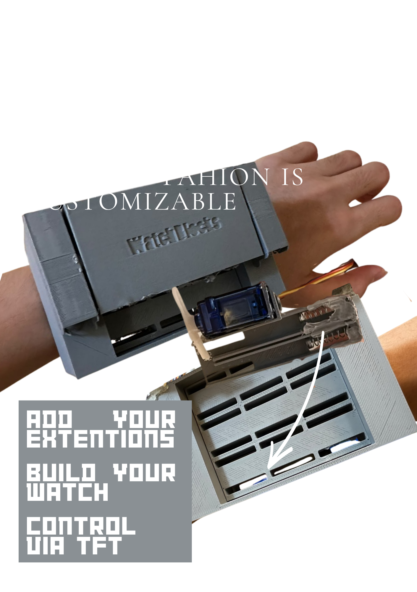

# WatchBlocks
The New Fashion is Customizable

## Inspired by the legendary "PhoneBlocks"  
A watch that can be added on extensions.

## How it started
This idea came to me when I saw the story of the PhoneBlocks Movement and how it eventually died out. I suppose an issue was also that nobody was willing to risk having their phones being blocks., and rather go with traditional "Big Brands"  
So, I lowered it down into a compact watch, well its more of a wrist bracelet thingymabob if you think about it. (WatchBlocks sounds cooler than Wrist-Bracelet-ThingymabobBlocks)  

## BOM
# WatchBlocks - Bill of Materials (BOM)

## Core Components

| Component | Description | Qty | Cost |
|------------|------------|------|------|
| ESP32S3 XIAO | Microcontroller | 1 | $13.73 |
| 1.8" TFT Touch Screen Display | UI Display | 1 | $2.57 |
| Perfboard Wires | Connect the circuit | 1 | $1.48 |
| Female Pin Header (1x40) | Solder to PCB | 1 | $0.20 |
| Male Pin Header (1x40) | Connect extensions to socket | 6 | $0.72 |
| Magnets (10 pcs) | Locking extensions and closures | 1 | $1.20 |
| DS3231 RTC Module | Track local time offline | 1 | $2.21 |

## Power System

| Component | Description | Qty | Cost |
|------------|------------|------|------|
| AAA Battery (x2) | Supply power | 1 | $1.03 |
| Battery Snap Connector | Battery connection | 2 | $0.28 |
| Velcro Strap | Wrist strap | 1 | $3.01 |
| Velcro Patch | Attach block to strap | 1 | $1.15 |

## Speaker Extension

| Component | Description | Qty | Cost |
|------------|------------|------|------|
| 4Ω Speaker | Audio output | 1 | $3.63 |

## Rocket Launcher 3000 Extension

| Component | Description | Qty | Cost |
|------------|------------|------|------|
| Servo Motor | Launch mechanism | 1 | $1.54 |
| Springs | Hold and launch rockets | 1 | $0.76 |

---

# Total Cost

**$33.51**

## Files
STL files include an extentions folder which are for the speaker extention and rocket launcher extentions.   
If you want to make your own extention which you definetly should (its the whole purpose of this project) modify (WatchBlocksTemplate)  
PCB file has 2 pcb inside for the top (left) and bottom layer (right).

## Where everything goes
Start by soldering the wires then sliding in the tft.
Close the lid
